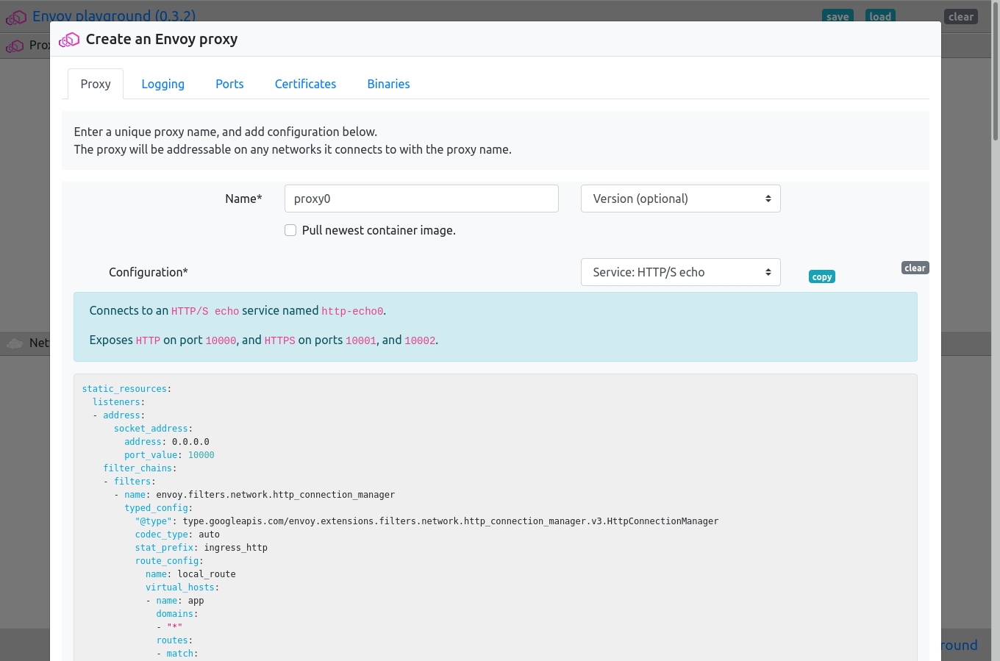
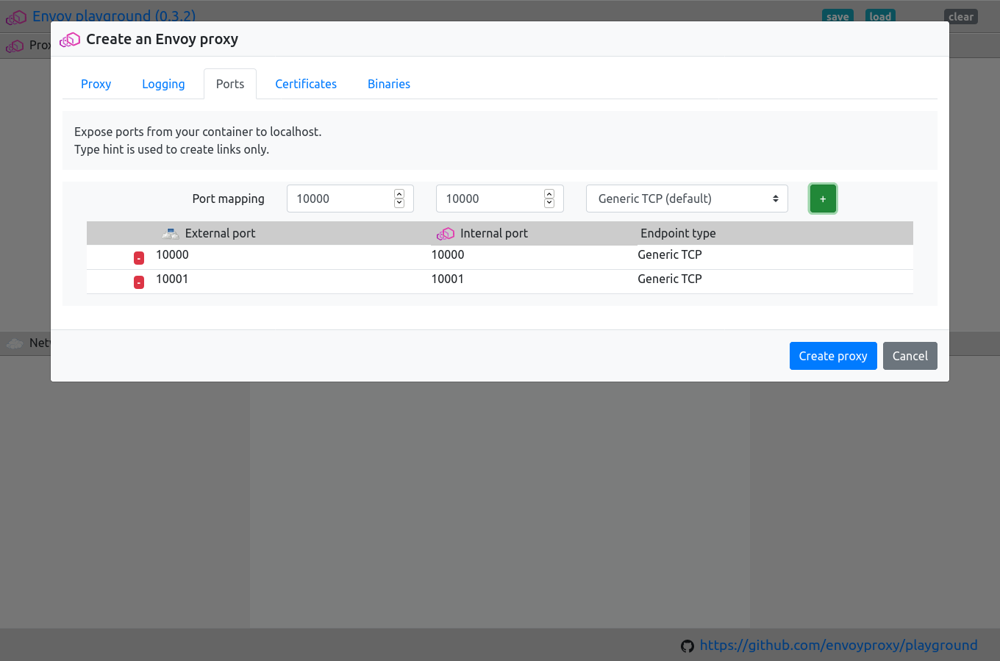
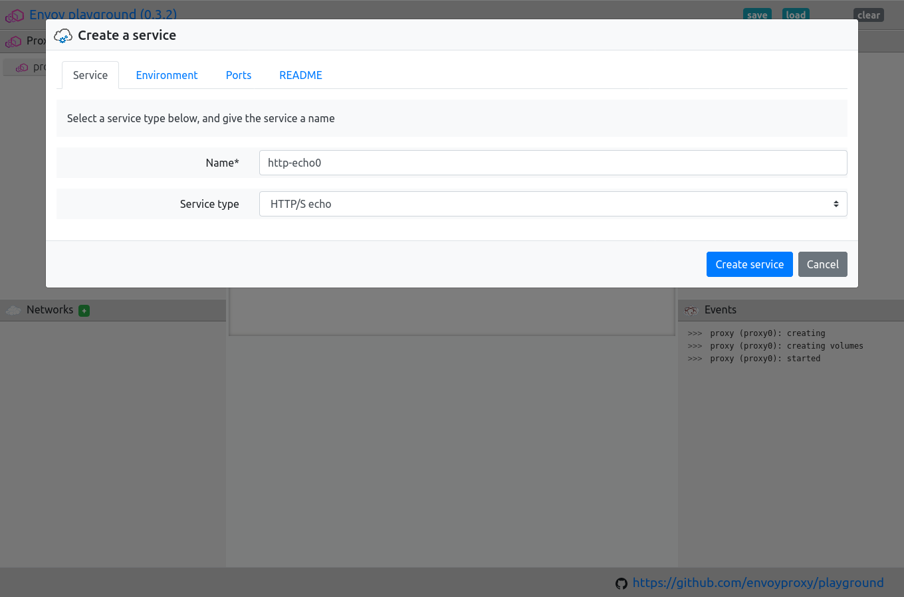
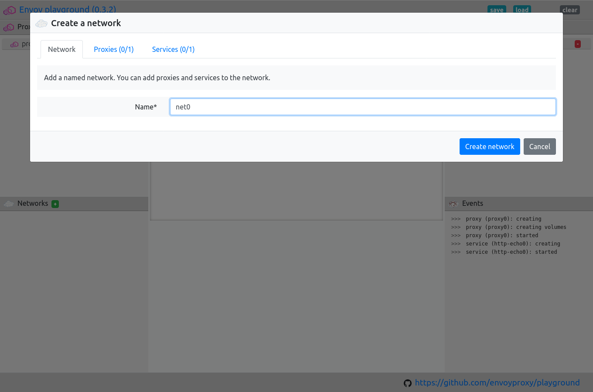
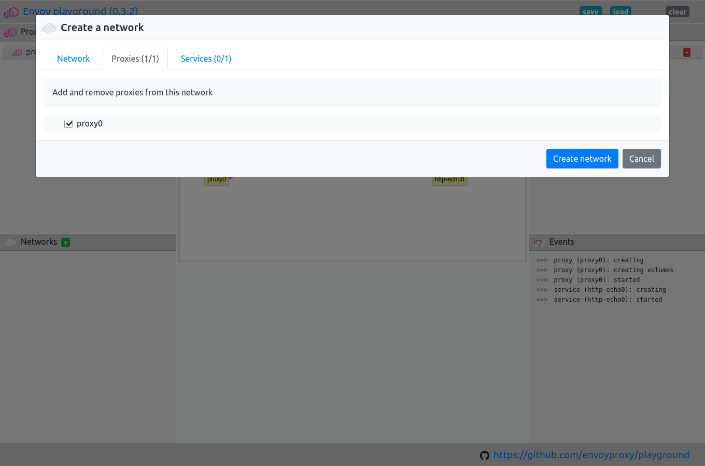
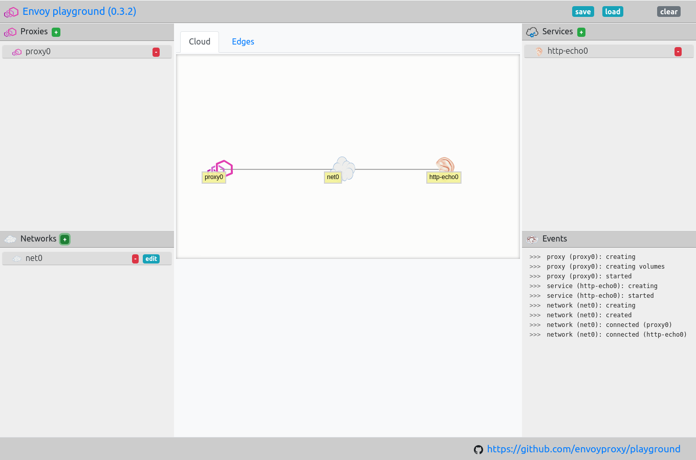
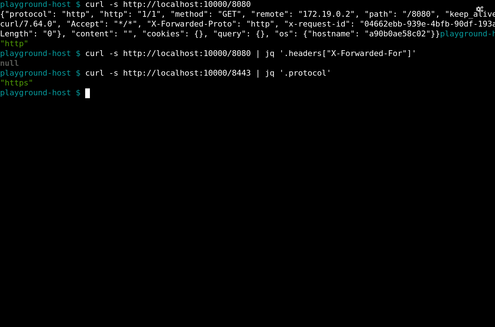
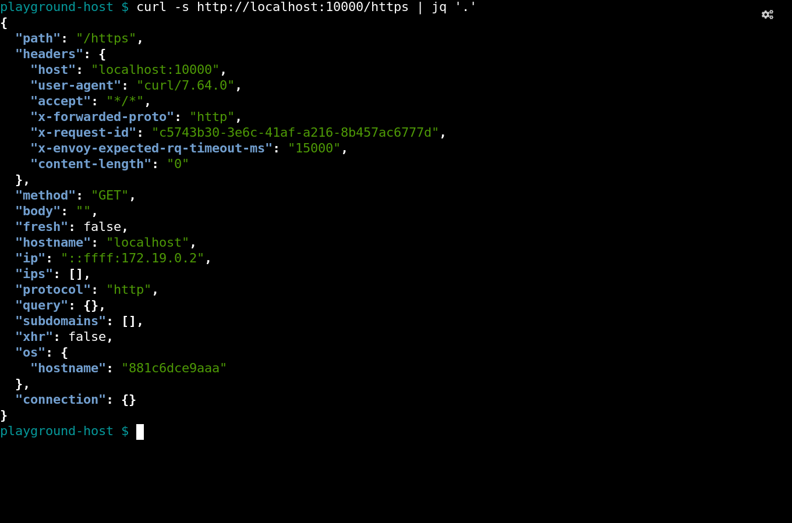

.. _journey_front_proxy:

Front proxy with ``http-echo``
==============================

Envoy proxy can be used both as a "front" proxy, proxying between end users and upstream services,
or as a "middle" proxy, proxying between services not exposed to end users.

This example demonstrates some of the ways that Envoy can be used as a "front" proxy.

It demonstrates Envoy terminating both ``HTTP`` and ``HTTPS`` and proxying to both ``HTTP`` and ``HTTPS`` upstream  services.

It  also  demonstrates Envoy in passthrough mode in which Envoy acts a simple TCP server proxying to an upstream ``HTTPS`` service
without doing any ``HTTP`` termination itself.

.. _journey_front_proxy_start:

.. rst-class::  clearfix

Create an Envoy proxy using ``HTTP`` echo example
-------------------------------------------------

You can give the proxy any valid name.

In this example the proxy is named ``proxy0``.

Once you have added the name, you will be able to configure the proxy.

Select the "Service: HTTP/S echo" example from the configuration dropdown.

.. _journey_front_proxy_proxy_port_mappings:

.. rst-class::  clearfix

Map ports and start the proxy
-----------------------------

This example exposes three internal ports ``10000``, ``10000`` and ``10002``.

Click on the "Ports" tab, and map each of these to the corresponding external port.

Once you have added the ports, click the "Create proxy" button.

.. _journey_front_proxy_service_create:

.. rst-class::  clearfix

Create an "HTTP/S echo" service called ``http-echo0``
-----------------------------------------------------

The name given to the service *must match* the name used in the :ref:`example configuration <journey_front_proxy_start>`.

By default the "Service: HTTP/S echo" example configuration uses the the name ``http-echo0``.

Create a service with this name.

.. _journey_front_proxy_network_start:

.. rst-class::  clearfix

Create a network
----------------

The name given to the network is arbitrary.

In this example, the network is named ``net0``.

.. _journey_front_proxy_network_proxies:

.. rst-class::  clearfix

Add the proxy and service to the network and create
---------------------------------------------------

The proxy and service need to be connected to this network.

Click on the "Proxies" tab and select "proxy0".

Now do the same for the service you added.

Once you have added the proxy and the service, click the "Create network" button.

.. _journey_front_proxy_network_started:

.. rst-class::  clearfix

Network created and example is set up
-------------------------------------

Once the network has been created, the example should be set up, and ready to test.

.. _journey_front_proxy_console_http:

.. rst-class::  clearfix

Test the connections on port ``10000``
--------------------------------------

The example exposes two endpoints on port ``10000``.

- http://localhost:10000/8080 - proxies to upstream ``HTTP``.
- http://localhost:10000/8443 - proxies to upstream ``HTTPS``.

While the second endpoint proxies to an ``HTTPS`` upstream, the endpoints exposed on this port are
``HTTP``.

If you query the first you should see that both the ``protocol`` and the ``X-Forwarded-Proto`` header
are showing ``http``

.. code-block::  console

   $ curl -s http://localhost:10000/8080 | jq '.protocol'
   "http"
   $ curl -s http://localhost:10000/8080 | jq '.headers["X-Forwarded-Proto"]'
   "http"

Querying the second endpoint, the ``X-Forwarded-Proto`` remains ``http``, but the ``protocol`` should now show ``https``.

.. code-block::  console

   $ curl -s http://localhost:10000/8443 | jq '.protocol'
   "https"
   $ curl -s http://localhost:10000/8443 | jq '.headers["X-Forwarded-Proto"]'
   "http"

.. _journey_front_proxy_console_https:

.. rst-class::  clearfix

Test the connections on port ``10001``
--------------------------------------

The example exposes two endpoints on port ``10001``.

- https://localhost:10001/8080 - proxies to upstream ``HTTP``.
- https://localhost:10001/8443 - proxies to upstream ``HTTPS``.

While the first endpoint proxies to an ``HTTP`` upstream, the endpoints exposed on this port are
``HTTPS``.

The ``TLS`` termination that you see when querying this port is done by the Envoy proxy.

When connecting to the upstream ``HTTPS`` the connection is again encrypted and the upstream ``TLS``
termination is provided by the echo server.

.. tip::

   As the certificates used for this example are not issued by a known authority, you will need to use the
   the ``-k`` flag with ``curl``.

Querying the first endpoint, the ``X-Forwarded-Proto`` should show ``https``, but the ``protocol`` should be ``http``.

.. code-block::  console

   $ curl -sk https://localhost:10001/8080 | jq '.protocol'
   "http"
   $ curl -sk https://localhost:10001/8080 | jq '.headers["X-Forwarded-Proto"]'
   "https"

Querying the second, you should see that both the ``protocol`` and the ``X-Forwarded-Proto`` header
are showing ``http``

.. code-block::  console

   $ curl -sk https://localhost:10001/8443 | jq '.protocol'
   "https"
   $ curl -sk https://localhost:10001/8443 | jq '.headers["X-Forwarded-Proto"]'
   "https"
