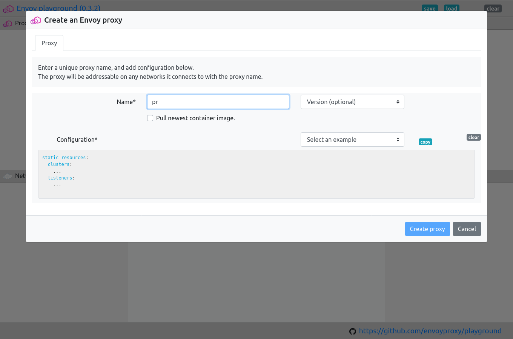
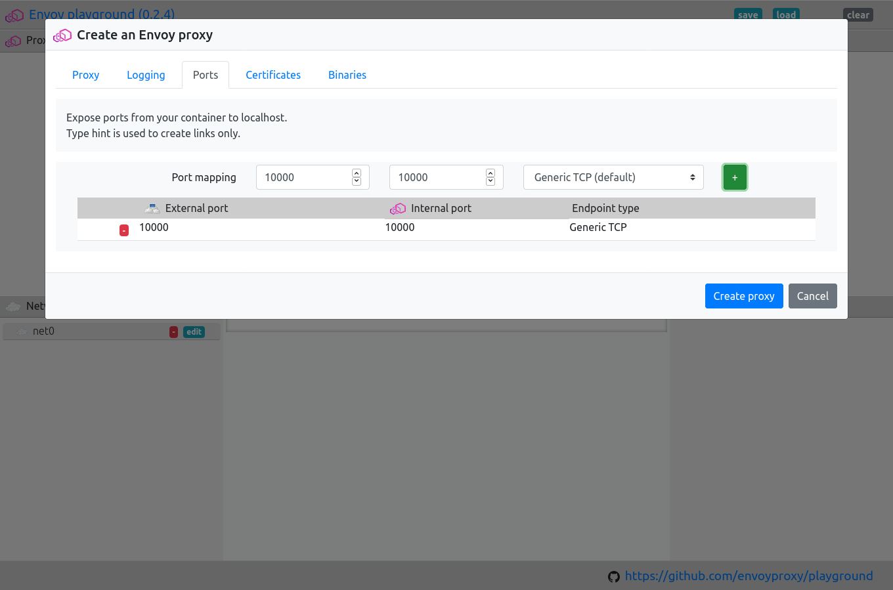
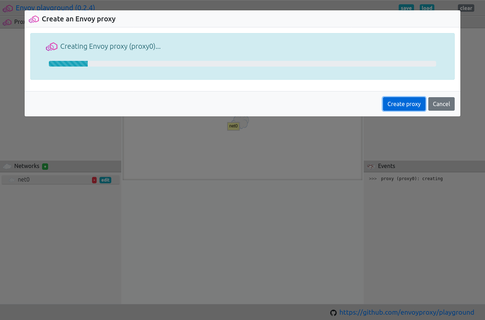
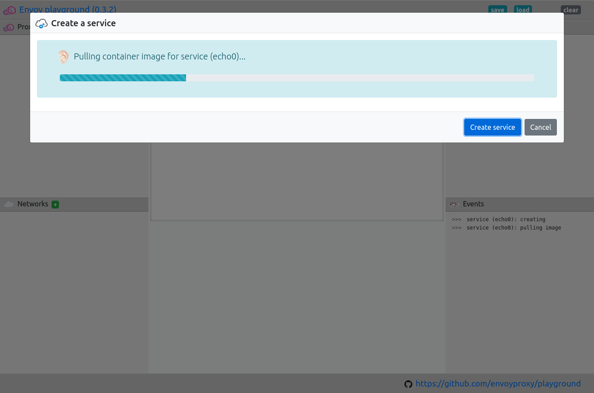

.. _journey_front_proxy:

Front proxy with ``http-echo``
==============================

This is one of the simplest setups.

.. _journey_front_proxy_start:

.. rst-class::  clearfix

Create an Envoy proxy
---------------------

.. _journey_front_proxy_proxy_configuration:

.. rst-class::  clearfix

Select ``Service: HTTP/S echo`` configuration example
-----------------------------------------------------

Once you have added the name, you will be able to configure the proxy.

.. _journey_front_proxy_proxy_port_mappings:

.. rst-class::  clearfix

Map port `10000` -> `10000`
---------------------------

.. _journey_front_proxy_proxy_start:

.. rst-class::  clearfix

Start the proxy
---------------

.. _journey_front_proxy_service_create:

.. rst-class::  clearfix

Create an ``HTTP/S echo`` service called ``echo``
-------------------------------------------------

.. _journey_front_proxy_service_start:

.. rst-class::  clearfix

Start the service
-----------------

.. _journey_front_proxy_network_start:

.. rst-class::  clearfix

Create a network and add `proxy0` and `echo` to it
--------------------------------------------------

.. _journey_front_proxy_network_started:

.. rst-class::  clearfix

Network created
---------------

..  figure:: ../screenshots/journey.front_proxy.all.png
    :figclass: screenshot with-shadow
    :figwidth: 40%
    :align: right

.. _journey_front_proxy_console_http_http:

.. rst-class::  clearfix

Open a console and curl upstream `HTTP` on port ``10000``
---------------------------------------------------------

..  figure:: ../screenshots/journey.front_proxy.console.http.png
    :figclass: screenshot with-shadow
    :figwidth: 40%
    :align: right

.. _journey_front_proxy_console_http_https:

.. rst-class::  clearfix

Open a console and curl upstream `HTTPS` on port ``10000``
----------------------------------------------------------

..  figure:: ../screenshots/journey.front_proxy.console.https.png
    :figclass: screenshot with-shadow
    :figwidth: 40%
    :align: right
