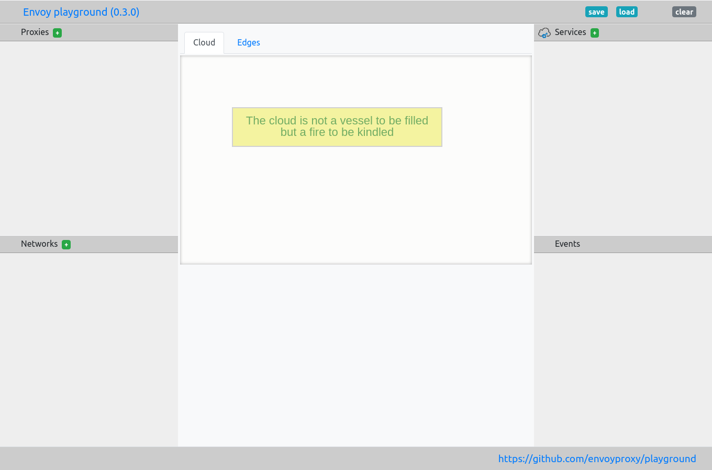
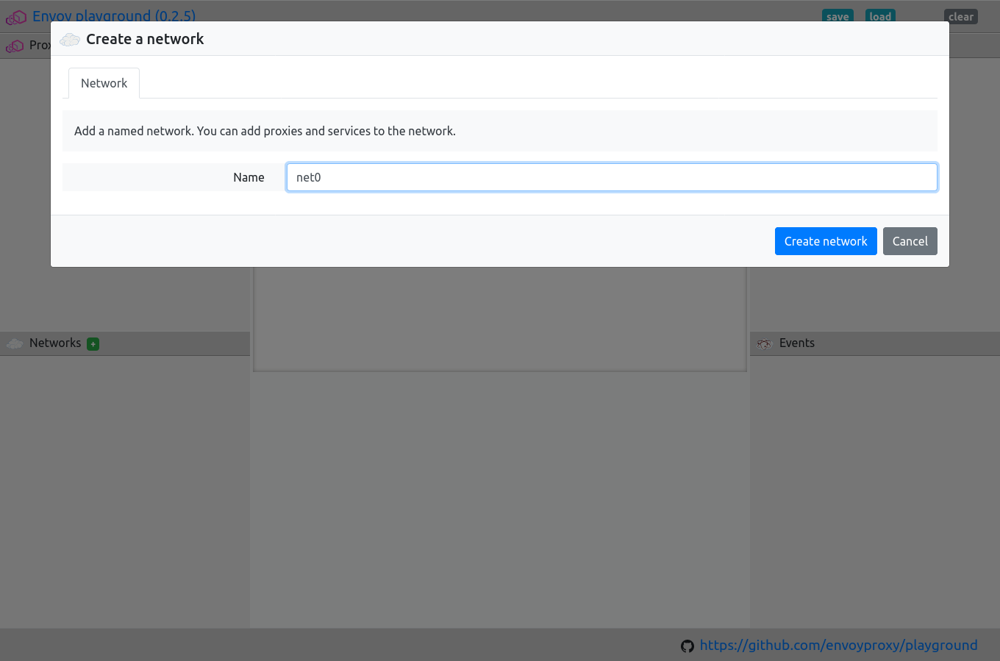
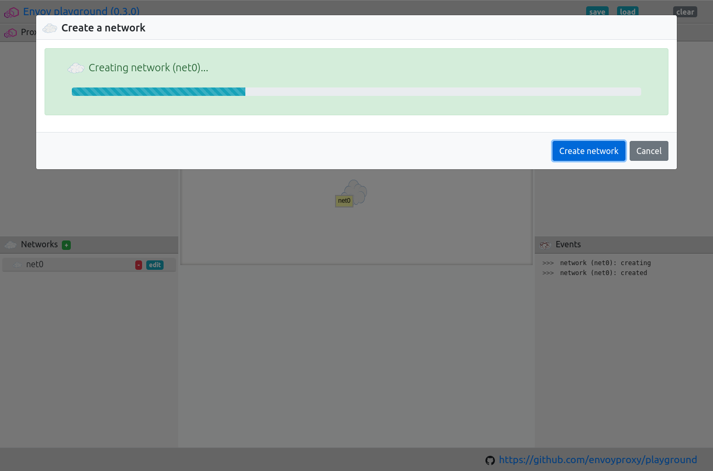
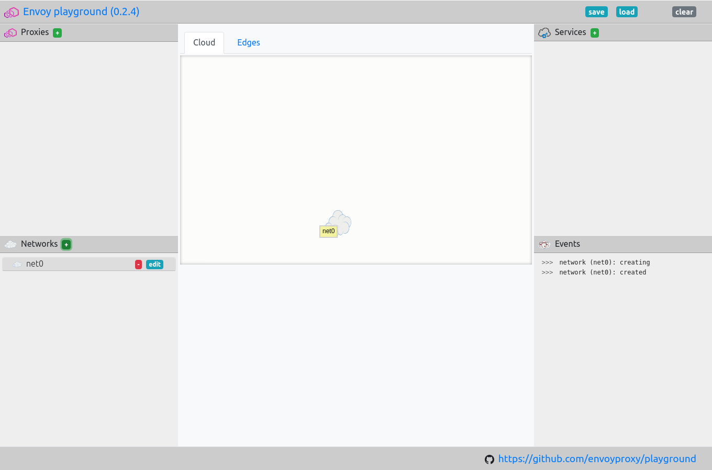

.. _network_create:

Create a network
================

Adding networks to the playground allows you to test your Envoy
configurations and network setups with different upstream providers.

.. _network_create_dialogue:

.. rst-class::  clearfix

Open the create network dialogue
--------------------------------

Open the playground, and click on the green ``+`` next to "Networks".

This should open the network create dialogue.

.. rst-class::  inline-tip

.. tip::

   You can use ``ctrl+alt+n`` to open the create new network dialogue.

.. _network_create_name:

.. rst-class::  clearfix

Enter the network name and select a version
-------------------------------------------

Give the network a unique name.

It should be not too long and not too short, 4 or 5 characters is probably best.

The name should only include the characters a-z, 0-9, ``_``, ``-``, and ``.``.

.. _network_create_start:

.. rst-class::  clearfix

Create and start the network
----------------------------

Once you are happy with the configuration that you have set, click the "Create network" button.

If you are running this for the first time, or you have chosen to pull a new container image this can take some time.

After downloading the requested Envoy image, the playground wraps it in an image with hot-restart capability.

Connect the network to other networks or proxies
------------------------------------------------

Once the network has been created you should see it added to the network list on the right-hand side of the screen.

You will probably now want to create some proxies and networks to make use of the network.
