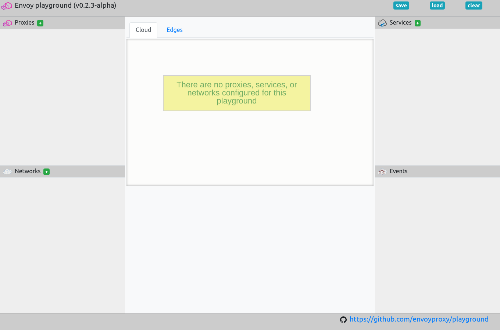
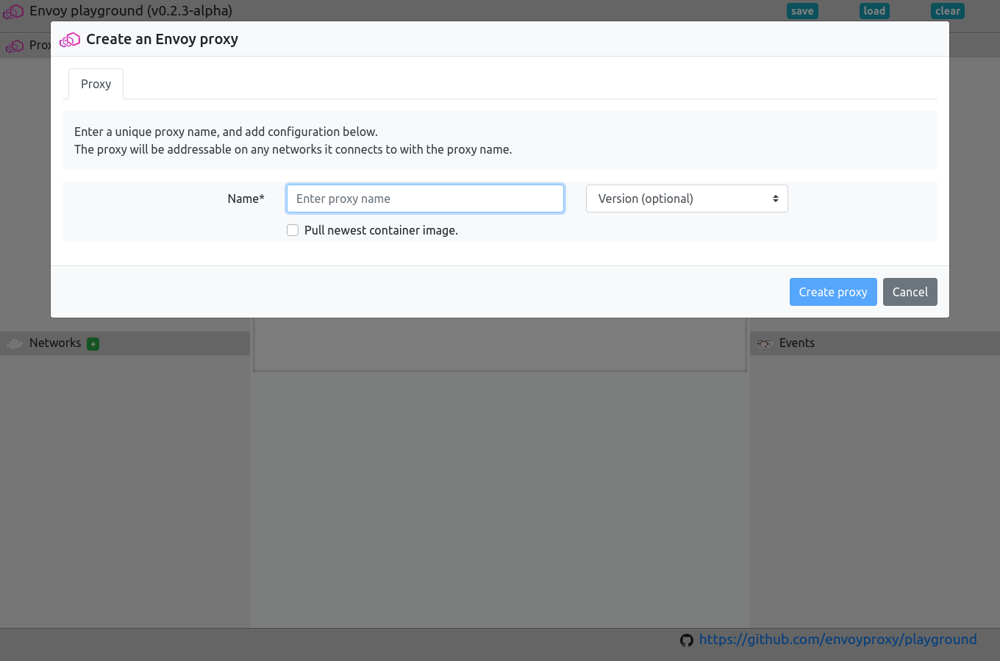
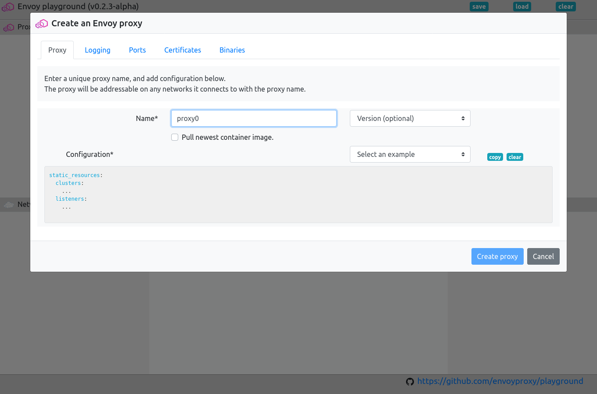

Create an Envoy proxy
=====================

Its easy to create an Envoy proxy in the playground.

Example configurations have been provided, or you can add your own.

Don't forget to add port mappings if you wish your proxy to be available
from outside of the playground.

.. rst-class::  clearfix

Open the playground
-------------------

Open the playground, and click on the green ``+`` next to "Proxies".

This should open the proxy create dialogue.

.. tip::

   You can use ``ctrl+alt+p`` to open the create new proxy dialogue.

.. rst-class::  clearfix

Enter the proxy name
--------------------

Give the proxy a name.

It should be not too long and not too short, 4 or 5 characters is probably best.

The name should only include the characters a-z, 0-9, ``_``, ``-``, and ``.``.

.. rst-class::  clearfix

Add an Envoy configuration
--------------------------

Once you have added the name, you will be able to configure the proxy.

At a mimimum you will need to provide an Envoy configuration.

A number of examples have been provided to work with the pre-installed services.

Add port mappings (optional)
----------------------------

Set the log level (optional)
----------------------------

Upload certificates for your proxy (optional)
---------------------------------------------

Upload binaries for your proxy (optional)
-----------------------------------------
