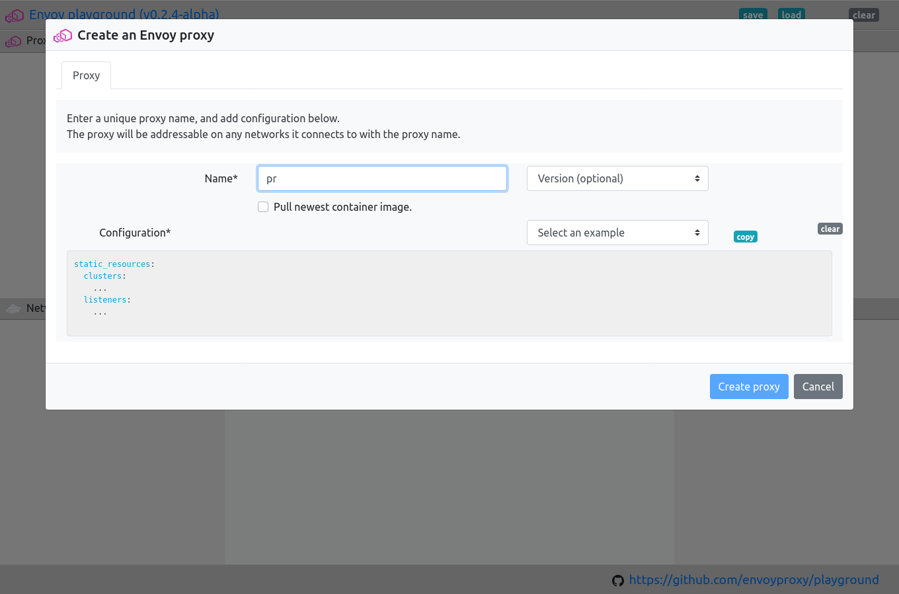
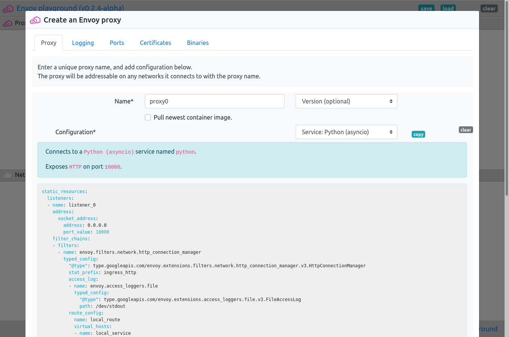
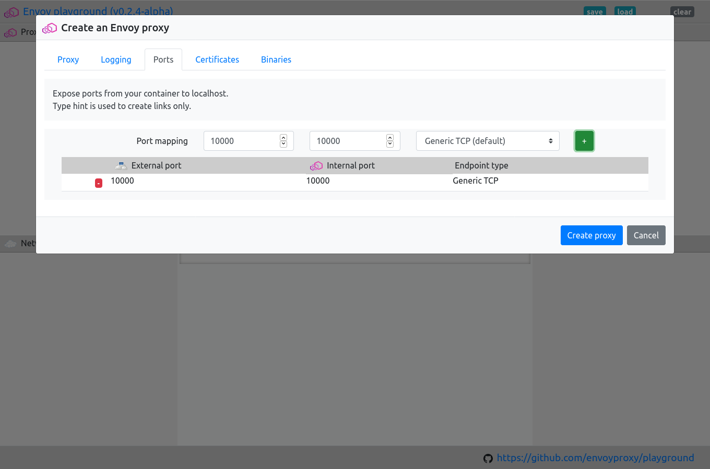
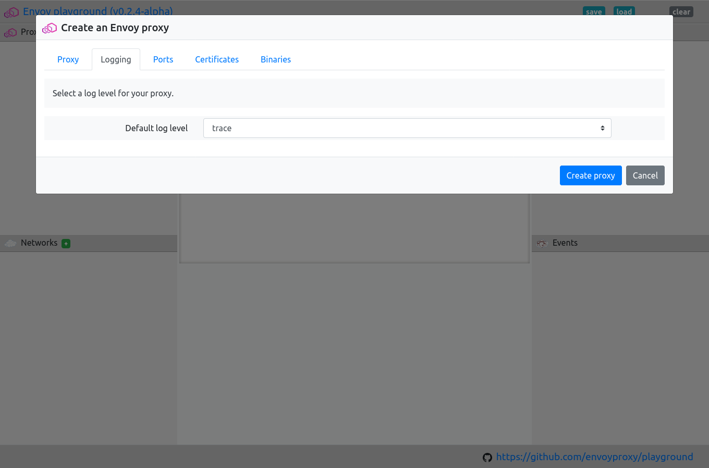
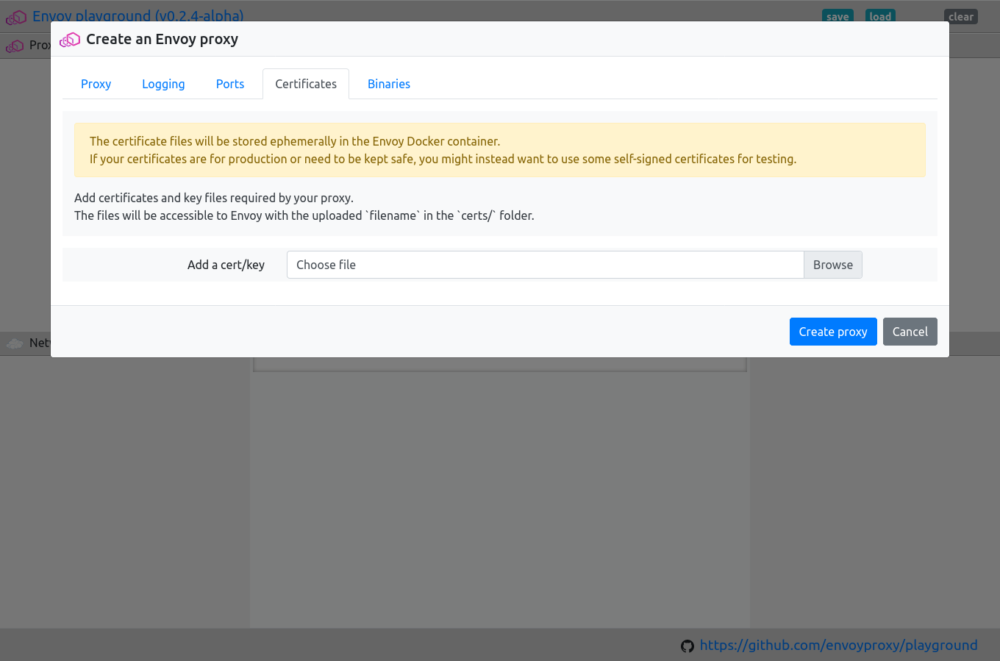
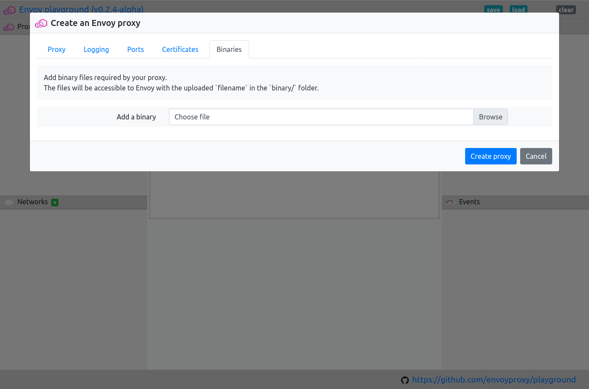
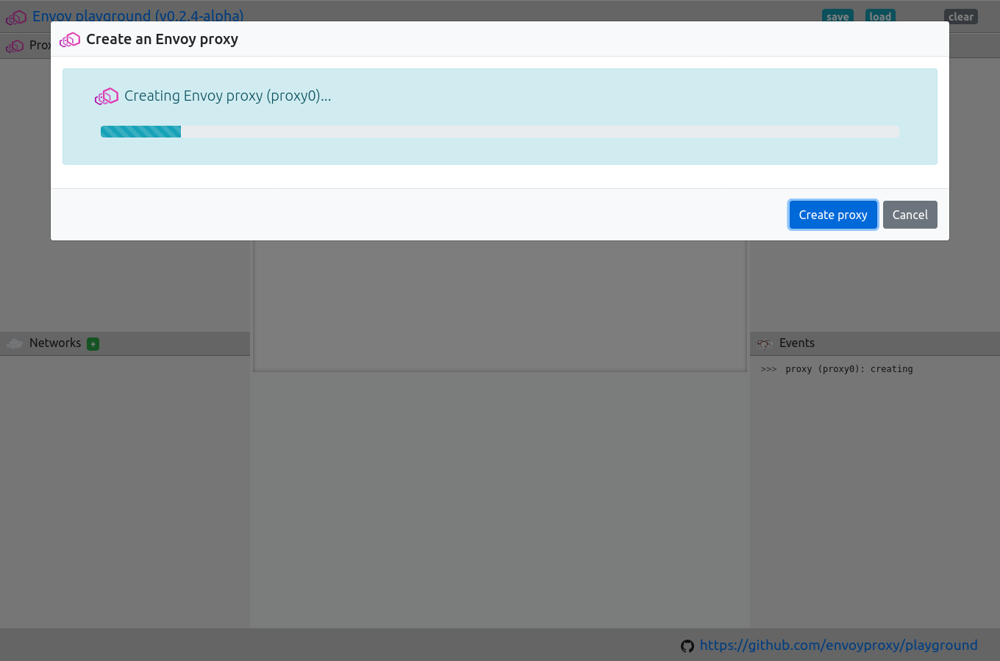

.. _proxy_create:

Create an Envoy proxy
=====================

Its easy to create an Envoy proxy in the playground.

Example configurations have been provided, or you can add your own.

.. tip::

   Don't forget to :ref:`add port mappings <proxy_create_port_mappings>` if you wish
   your proxy to be available from outside of the playground.

.. _proxy_create_dialogue:

.. rst-class::  clearfix

Open the create proxy dialogue
------------------------------

Open the playground, and click on the green ``+`` next to "Proxies".

This should open the proxy create dialogue.

.. rst-class::  inline-tip

.. tip::

   You can use ``ctrl+alt+p`` to open the create new proxy dialogue.

.. _proxy_create_name:

.. rst-class::  clearfix

Enter the proxy name and optionally select a version
----------------------------------------------------

Give the proxy a unique name.

It should be not too long and not too short, 4 or 5 characters is probably best.

The name should only include the characters a-z, 0-9, ``_``, ``-``, and ``.``.

You can also select which version of Envoy to use.

The default is to use the ``envoyproxy/envoy-dev:latest`` container image.

You can ensure you are using the most recently published image by selecting the
"Pull image" checkbox.

.. _proxy_create_configuration:

.. rst-class::  clearfix

Add an Envoy configuration
--------------------------

Once you have added the name, you will be able to configure the proxy.

At a mimimum you will need to provide an Envoy configuration.

A number of examples have been provided to work with the pre-installed services.

You can also add your own, or edit any of the examples to suit your needs.

.. _proxy_create_port_mappings:

.. rst-class::  clearfix

Add port mappings (optional)
----------------------------

If you wish the proxy to be addressable from outside of the playground (eg. to localhost),
you need to provide a port mapping.

The first port shown is the "external" port or the port which will be exposed on the host system.

The second port is the "internal" port, or the port upon which Envoy listens.

The external port should be unique across all proxies.

You can also set a type hint, for the port.

This is used to create links if it is an ``HTTP`` or ``HTTPS`` port, and for informational purposes.

The default is "Generic TCP".

.. _proxy_create_log_level:

.. rst-class::  clearfix

Set the log level (optional)
----------------------------

You can set the log level for your proxy.

This is particularly useful if you are trying to debug a problematic proxy connection or want to learn more
about how Envoy works.

The logs are available from the Docker container, the ``id`` of which will be shown once the proxy is created.

.. _proxy_create_certificates:

.. rst-class::  clearfix

Upload certificates for your proxy (optional)
---------------------------------------------

If your configuration requires the use of ``TLS`` certificates you can upload them here.

Once the proxy container is created, the uploaded certificates will be available in the ``/certs`` folder
inside the container.

.. warning::

   The certificates are stored in Docker volumes on your host system.

   If the certificates are sensitive or need to be kept secure, you may wish to generate self-signed certificates
   for use in the playground.

.. _proxy_create_binaries:

.. rst-class::  clearfix

Upload binaries for your proxy (optional)
-----------------------------------------

You can upload any binary or other library files that your Envoy configuration requires.

Once the container is created, the files will be available in the ``/binary`` folder inside the container.

.. _proxy_create_start:

.. rst-class::  clearfix

Create and start the proxy
--------------------------

BOOM!

Connect your proxy to other proxies or services
-----------------------------------------------

..  figure:: ../_static/screenshots/proxy.create.created.png
    :figclass: screenshot with-shadow
    :figwidth: 40%
    :align: right

BOOM!
