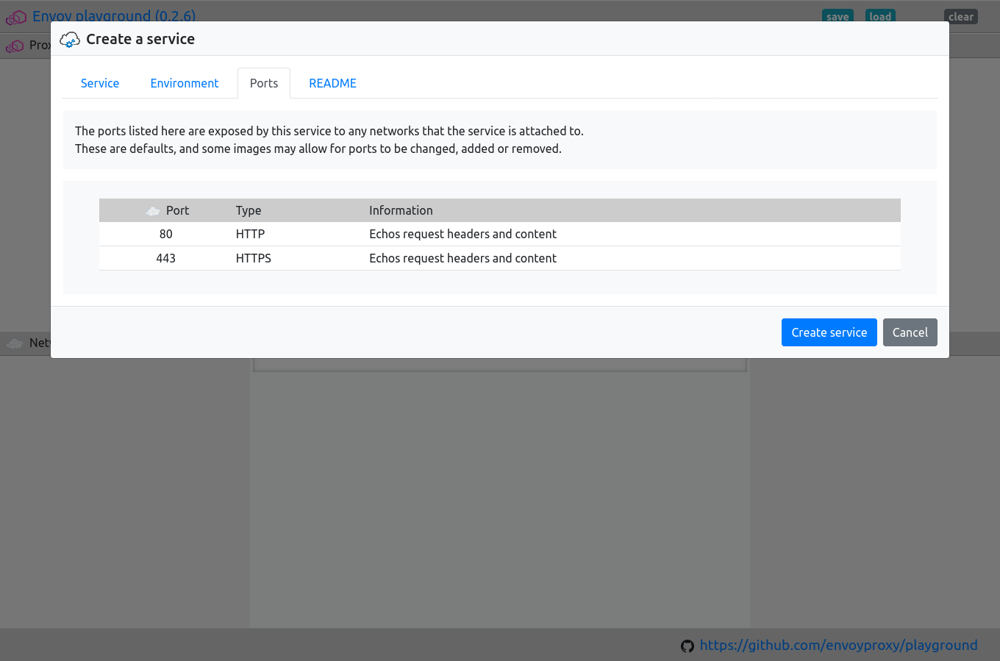
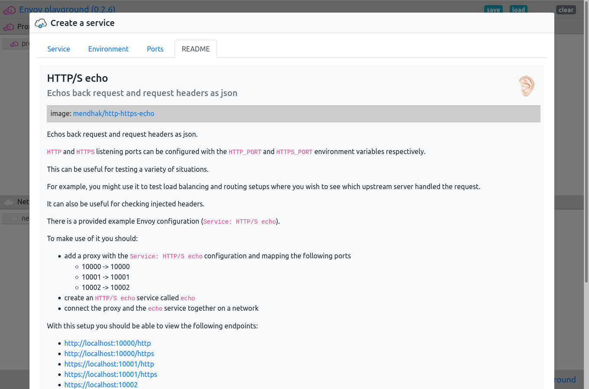
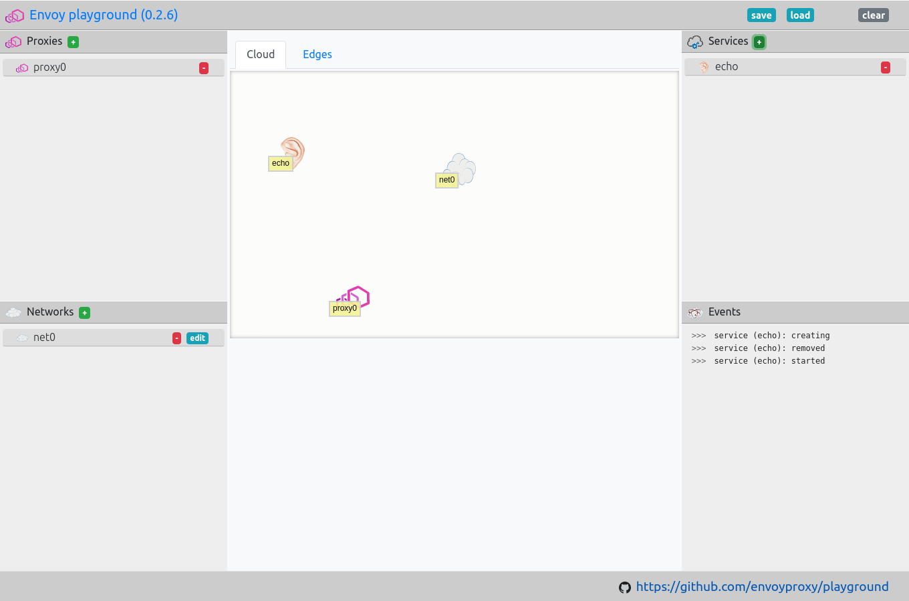

.. _service_create:

Create a service
================

Adding services to the playground allows you to test your Envoy
configurations and network setups with different upstream providers.

.. _service_create_dialogue:

.. rst-class::  clearfix

Open the create service dialogue
--------------------------------

..  figure:: ../screenshots/service.create.open.png
    :figclass: screenshot with-shadow
    :figwidth: 40%
    :align: right

Open the playground, and click on the green ``+`` next to "Proxies".

This should open the service create dialogue.

.. rst-class::  inline-tip

.. tip::

   You can use ``ctrl+alt+p`` to open the create new service dialogue.

.. _service_create_name:

.. rst-class::  clearfix

Enter the service name and select a version
-------------------------------------------

..  figure:: ../screenshots/service.create.name.png
    :figclass: screenshot with-shadow
    :figwidth: 40%
    :align: right

Give the service a unique name.

It should be not too long and not too short, 4 or 5 characters is probably best.

The name should only include the characters a-z, 0-9, ``_``, ``-``, and ``.``.

.. _service_create_ports:

.. rst-class::  clearfix

View the ports exposed by the service
-------------------------------------

All services in the playground will expose at least one `TCP`/ `IP`
port.

Any services or proxies connected to a network upon which the service is
also connected, can connect to the service.

They can do this using the service's name and by connecting to any ports that are exposed.

Here you can find information about which ports are exposed by default with the service.

Some images may allow you to change which ports are exposed, either by manipulating
the environment variables for the service, or by changing its configuration.

.. _service_create_readme:

.. rst-class::  clearfix

Check the README for the service
--------------------------------

Each service comes with a README with basic information about the service and the
container image it users.

The README should also outline how the service can be used within the playground.

.. _service_create_start:

.. rst-class::  clearfix

Create and start the service
----------------------------

..  figure:: ../screenshots/service.create.starting.png
    :figclass: screenshot with-shadow
    :figwidth: 40%
    :align: right

Once you are happy with the configuration that you have set, click the "Create service" button.

If you are running this for the first time, or you have chosen to pull a new container image this can take some time.

After downloading the requested Envoy image, the playground wraps it in an image with hot-restart capability.

Connect the service to other services or proxies
------------------------------------------------

Once the service has been created you should see it added to the service list on the right-hand side of the screen.

You will probably now want to create some proxies and networks to make use of the service.
